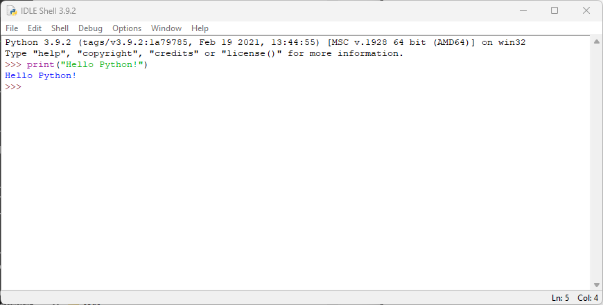
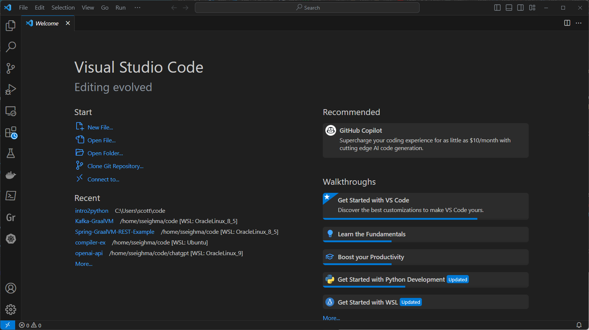
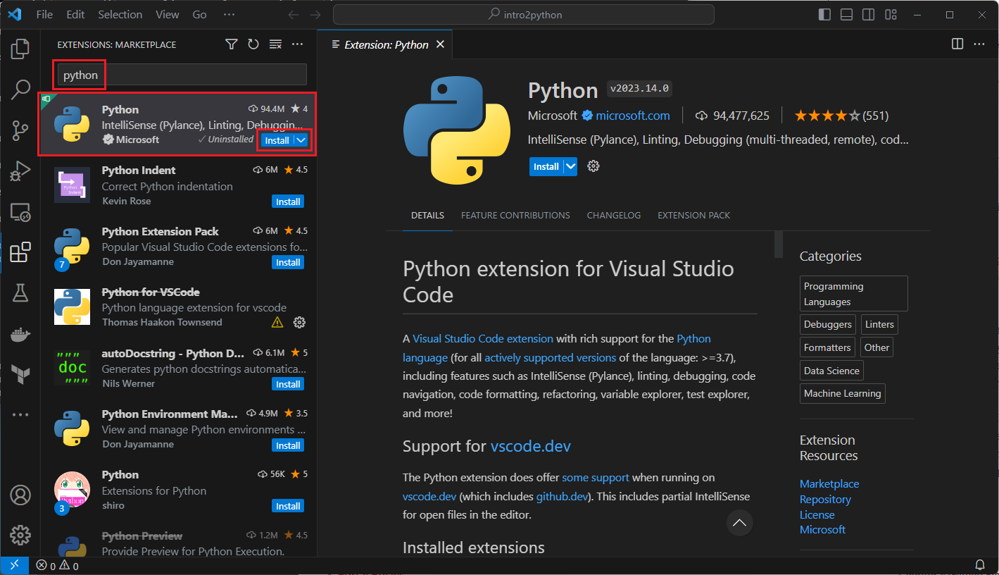

# Introduction to Python

## Credits
Portions of the material for this introduction to Python is derived from the book [Python Crash Course - Third Edition](https://nostarch.com/python-crash-course-3rd-edition).  It's available where ever you purchase your books.

### Introduction

Python is a general-purpose, high-level programming language. It is interpreted, meaning that it does not need to be compiled into machine code before it can be run. Python is known for its simple syntax and readability, making it a popular choice for beginners and experienced programmers alike.

Python was created in the late 1980s by Guido van Rossum, a Dutch computer scientist. Van Rossum was looking for a language that was more readable and easier to use than the languages that were available at the time. He named the language Python after the British comedy troupe Monty Python, because he was a fan of their work and wanted a name that was "short, unique, and slightly mysterious".

Python was first released in 1991, and it quickly gained popularity among programmers. It was used to develop a wide variety of applications, including web applications, desktop applications, and scientific computing applications.  Python is a cross-platform programming language, which means it runs on all the major operating systems. Any Python program you write should run on any modern computer that has Python installed. 

Python is a versatile language that can be used for a wide variety of tasks. It is commonly used for:

* **Web development**: Python can be used to develop both the front-end and back-end of web applications. It is a popular choice for developing web frameworks such as Django and Flask.
* **Software development**: Python can be used to develop desktop applications, mobile applications, and server-side applications. It is also used for developing machine learning and artificial intelligence applications.
* **Data science and machine learning**: Python is a popular choice for data science and machine learning tasks. It has a number of libraries and frameworks that are specifically designed for these tasks, such as NumPy, Pandas, and scikit-learn.
* **Automation**: Python can be used to automate a variety of tasks, such as system administration, data processing, and web scraping.

Python is a popular language for beginners because it is relatively easy to learn. The syntax is simple and readable, and there are a number of resources available to help beginners learn the language. Python is also a popular language for experienced programmers because it is versatile and powerful.

Here are some of the advantages of using Python:

* **Simple syntax**: Python has a simple and readable syntax, making it easy to learn and use.
* **Versatility**: Python can be used for a wide variety of tasks, from web development to data science to automation.
* **Power**: Python is a powerful language that can be used to develop complex applications.
* **Large community**: Python has a large and active community of users and developers. This means that there are a number of resources available to help you learn and use the language.

If you are interested in learning a programming language, Python is a great choice. It is relatively easy to learn, versatile, and powerful.

## Getting Started

#### Installing Python

Installing Python is generally easy, and nowadays many Linux and UNIX distributions include a recent Python. Even some Windows computers now come with Python already installed. If you do need to install Python and aren't confident about the steps, you can find a notes on the [BeginnersGuide/Download wiki page](https://wiki.python.org/moin/BeginnersGuide/Download), but installation is straightforward on most platforms.

#### Python Development Tools

Every Python installation comes with an **Integrated Development and Learning Environment**, which you’ll see shortened to **IDLE** or even IDE. These are a class of applications that help you write code more efficiently. While there are many IDEs for you to choose from, Python IDLE is very basic, which makes it the perfect tool for a beginning programmer.

Python IDLE comes included in Python installations on Windows and Mac. If you’re a Linux user, then you should be able to find and download Python IDLE using your package manager. Once you’ve installed it, you can then use Python IDLE as an interactive interpreter or as a file editor:



#### Using an Integrated Development Environment (IDE)

For our labs, we'll be using **Visual Studio Code**, a free coding editor that helps you start coding quickly. Use it to code in any programming language, without switching editors. Visual Studio Code has support for many languages, including Python, Java, C++, JavaScript, and more.

[Visual Studio Code](https://code.visualstudio.com/) is built with extensibility in mind. From the UI to the editing experience, almost every part of VS Code can be customized and enhanced through the Extension API. In fact, many core features of VS Code are built as extensions and use the same Extension API.



We'll be using a Python extension to help guide us through the coding exercises:



At a basic level, you can choose to use the command line interface (CLI) to write and execute Python scripts in interactive mode. It's straightforward and simple but can become a bit cumbersome when you begin to write more advanced applications.

First, open a Windows Terminal:

1. Press `Win + X` to open the menu.
2. Scroll down to **Terminal** and click on the Terminal app (or enter "i" as a shortcut)

A Windows Terminal will be displayed.

Enter `python` to start the interpreter:

```
C:\> python
Python 3.9.13 (tags/v3.9.13:6de2ca5, May 17 2022, 16:36:42) [MSC v.1929 64 bit (AMD64)] on win32
Type "help", "copyright", "credits" or "license" for more information.
>>> ^Z (Enter)

C:\>
```

>To exit the interpreter, type `CTRL + Z`, then the **Enter** key or type `exit()` and then the **Enter** key.

Let's enter some commands in the Python interpreter:

```
C:\> python
Python 3.9.13 (tags/v3.9.13:6de2ca5, May 17 2022, 16:36:42) [MSC v.1929 64 bit (AMD64)] on win32
Type "help", "copyright", "credits" or "license" for more information.
>>> print("Hello Python interpreter!")
Hello Python interpreter!
```

The interactive interpreter is a good introductory platform to learn core Python syntax and features. Experienced Python developers often open a Python interpreter to quickly check out an infrequently used command or function.

You can create a Python script and run the script via the CLI too.  For example, open Notepad (`Win + R`, then type `notepad` and hit the `Enter key`) and add the following line:

```
print("Hello Python world!")
```

Click `File->Save As` and enter `hello_world.py`.

>`.py` is the standard file extension for Python source code files. These files contain Python code that can be executed by a Python interpreter.

Enter the following command to run `hello_world.py`:

```
C:\> python hello_world.py
Hello Python world!
```

#### Running Python in a Browser
There are also options for running Python code within a browser session, executed in either the browser process or some separate server-based component. 

**Replit**

A Repl (derived from REPL—"read-eval-print loop") is an interactive programming environment where you can write and execute code in real-time.

From their site:

*Replit provides a large range of tools and features necessary for software development. It serves as an IDE, a code collaboration platform, a cloud provider, a developer community, and so much more.*

The workspace is like an IDE (Integrated Development Environment), providing a comprehensive set of development tools and features for creating, debugging, and managing your software. It helps you quickly and easily create, modify, and collaborate on your code.

Visit [https://replit.com/](https://replit.com/) to try out the environment.

**PyScript** is an example of a browser process.

A recent development in the Python-in-a-browser endeavor is the release of PyScript by Anaconda. PyScript is built on top of Pyodide,7 which uses WebAssembly to bring up a full Python engine in the browser. PyScript introduces custom HTML tags so that you can write Python code without having to know or use JavaScript. Using these tags, you can create a static HTML file containing Python code that will run in a remote browser, with no additional installed software required.

A simple PyScript “Hello, World!” HTML file might look like this:

```
<html>
<head>
    <link rel='stylesheet' 
 href='https://pyscript.net/releases/2022.06.1/pyscript.css' />
    <script defer 
 src='https://pyscript.net/releases/2022.06.1/pyscript.js'></script>
</head>
<body>
<py-script>
import time
print('Hello, World!')
print(f'The current local time is {time.asctime()}')
print(f'The current UTC time is {time.asctime(time.gmtime())}')
</py-script>
</body>
</html>
```

You can save this code snippet as a static HTML file and successfully run it in a client browser, even if Python isn’t installed on your computer.

>NOTE : 
>PyScript is still in early development, so the specific tags and APIs shown here are likely to change as the package undergoes further development.

For more complete and up-to-date information, see the [PyScript website](https://pyscript.net/).

Next, we'll walk through basic features of the Python language:

* Variables
* Data Types
    * Strings
    * Numbers
    * Collections (Lists)
* User Input
* Loops
    * For Loops
    * While Loops
* Conditionals
* Formatting
* Comments


## Resources

[Python Documentation](https://docs.python.org/3/)

[Python Cheat Sheets](https://github.com/ehmatthes/pcc_3e/blob/main/cheat_sheets/bw_sheets/beginners_python_cheat_sheet_pcc_all_bw.pdf)

[Beginners Guides](https://wiki.python.org/moin/BeginnersGuide/Programmers)


